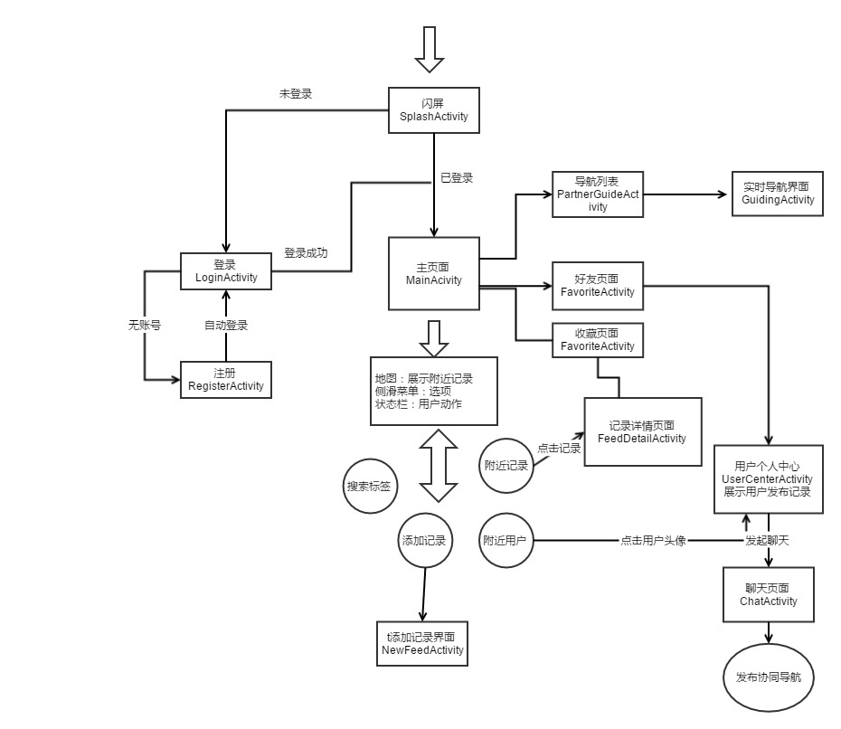

# 系统说明
## 一、使用的技术栈
* LeandCode（数据存储，实时通信）
* EventBus（组件间通信）
* BaiDu Map SDK（地图模块）
* Glide(图片加载显示)
* Picture-Library(图片选择裁剪压缩)

## 二、自定义View相关
* LabelTextView（标签式TextView）
* SlidingMenu(侧滑菜单)

## 三、项目结构

### Module
* app 主模块
* base 项目通用的内容，包括基类，自定义view等
* map 百度地图的封装模块
* RTPermission Android运行时权限处理模块
* model 数据模型模块

### app Module
- activity (APP页面)
- adapter （列表使用的适配器）
- event （EventBus事件）
- feature (登录注册契约)
- helper （一些工具）
- im （即时通信相关）
- mvp （MVP结构）
    - contract（契约）
    - model（模型）
    - presenter（处理）
    
App    

### 
